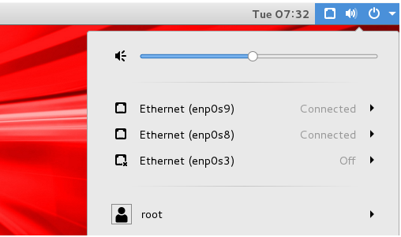
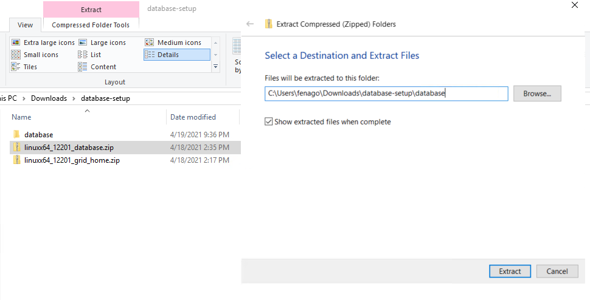
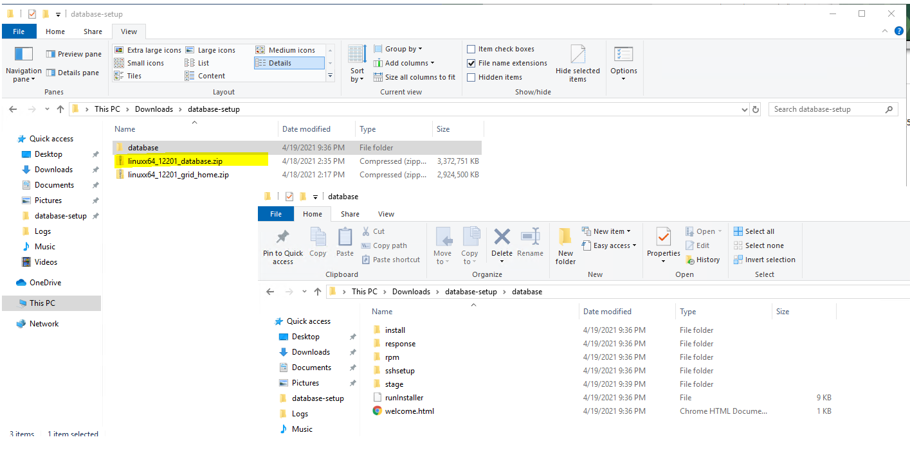

Oracle Database 12c Release 2 (12.2) RAC On Oracle Linux 7 Using VirtualBox
===========================================================================

This labs covers the installation of Oracle Database 12c Release 2
(12.2 64-bit) RAC on Linux (Oracle Linux 7 64-bit) using VirtualBox with no additional shared disk devices.

-   Introduction
-   Download Software
-   VirtualBox Installation
-   VirtualBox Network Setup
-   Virtual Machine Setup
-   Guest Operating System Installation
-   Oracle Installation Prerequisites
    -   Automatic Setup
    -   Manual Setup
    -   Additional Setup
-   Install Guest Additions
-   Create Shared Disks
-   Clone the Virtual Machine
-   Install the Grid Infrastructure
-   Install the Database Software
-   Create a Database
-   Check the Status of the RAC

Introduction
------------

Using VirtualBox you can run multiple Virtual Machines (VMs) on a single
server, allowing you to run both RAC nodes on a single machine. In
addition, it allows you to set up shared virtual disks, overcoming the
obstacle of expensive shared storage.

Before you launch into this installation, here are a few things to
consider.

-   The finished system includes the host operating system, two guest
    operating systems, two sets of Oracle Grid Infrastructure
    (Clusterware + ASM) and two Database instances all on a single
    server. As you can imagine, this requires a significant amount of
    disk space, CPU and memory.
-   Following on from the last point, the VMs will each need at least 8G
    of RAM, preferably more if you don't want the VMs to swap like
    crazy. 
-   This procedure provides a bare bones installation to get the RAC
    working. There is no redundancy in the Grid Infrastructure
    installation or the ASM installation. To add this, simply create
    double the amount of shared disks and select the "Normal" redundancy
    option when it is offered. Of course, this will take more disk
    space.
-   During the virtual disk creation, We can choose not to preallocate
    the disk space. This makes virtual disk access slower during the
    installation, but saves on wasted disk space. The shared disks must
    have their space preallocated.
-   The Single Client Access Name (SCAN) should be defined in the DNS or
    GNS and round-robin between one of 3 addresses, which are on the
    same subnet as the public and virtual IPs. Prior to 11.2.0.2 it
    could be defined as a single IP address in the "/etc/hosts" file,
    which is wrong and will cause the cluster verification to fail, but
    it allowed you to complete the install without the presence of a
    DNS. This does not seem to work for 11.2.0.2 onward.
-   The virtual machines can be limited to 2Gig of swap, which causes a
    prerequisite check failure, but doesn't prevent the installation
    working. If you want to avoid this, define 3+Gig of swap.
-   This article uses the 64-bit versions of Oracle Linux and Oracle 12c Release 2.

This procedure should run successfully on a Linux and Windows host.
Where applicable, I've included both the Linux and Windows commands to
be run on the host, so pick the relevant ones.

** Although I have completed this installation with 4G VMs, it was
chronically slow. I would suggest using as much memory as possible,
without making the host OS swap.

Download Software
-----------------

Download the following software.

-  Oracle Linux 7.3 
-  VirtualBox (5.1.14)
-  Oracle 12c Release 2 (12.2.0.1) Software (64 bit)

Depending on your version of VirtualBox and Oracle Linux, there may be
some slight variation in how the screen shots look.

VirtualBox Installation
-----------------------

First, install the VirtualBox software. On RHEL and its clones you do
this with the following type of command as the root user. On windows,
just run the ".exe".

    # rpm -Uvh VirtualBox*.rpm

The package name will vary depending on the host distribution you are
using. Once complete, VirtualBox is started from the menu.

VirtualBox Network Setup
------------------------

We need to make sure a host-only network is configured and check/modify
the IP range for that network. This will be the public network for our
RAC installation.

-   Start VirtualBox from the menu.

-   Select the "File \> Preferences" menu option.

-   Click "Network" in the left pane and click the "Host-only Networks"
    tab.

-   Click the "Adds new host-only network" button on the right size of
    the screen. Depending on the host OS, a network called "vboxnet0" or
    "VirtualBox Host-Only Ethernet Adapter" will be created.

    

    Click the "Edits selected host-only network." button on the right
    size of the screen.

-   If you want to use a different subnet for your public addresses you
    can change the network details here. Just make sure the subnet you
    choose doesn't match any real subnets on your network. I've decided
    to stick with the default, which for me is "192.168.56.X".

    

-   Use the "OK" buttons to exit out of this screen.
-   Click the "NAT Networks" tab. If you don't have a NAT network
    defined, click the "+" button. You shouldn't need to configure this.
-   Click the "OK" button to close the preferences dialog.

Virtual Machine Setup
---------------------

Now we must define the two virtual RAC nodes. We can save time by
defining one VM, then cloning it when it is installed.

Start VirtualBox and click the "New" button on the toolbar. Enter the
name "ol7-122-rac1", OS "Linux" and Version "Oracle (64 bit)", then
click the "Next" button.

Enter "4096" as the base memory size, then click the "Next" button. Use
more memory if you have enough physical memory on your machine as it
will make the process much quicker!

Accept the default option to create a new virtual hard disk by clicking
the "Create" button.

Acccept the default hard drive file type by clicking the "Next" button.

Acccept the "Dynamically allocated" option by clicking the "Next"
button.

Accept the default location and set the size to "50G", then click the
"Create" button. If you can spread the virtual disks onto different
physical disks, that will improve performance.

The "ol7-122-rac1" VM will appear on the left hand pane. Scroll down the
details on the right and click on the "Network" link.

Make sure "Adapter 1" is enabled, set to "NAT", then click on the
"Adapter 2" tab.

Make sure "Adapter 2" is enabled, set to "Host-only Adapter", then click
on the "Adapter 3" tab.

Make sure "Adapter 3" is enabled, set to "Internal Network", then click
on the "System" section.

Move "Hard Disk" to the top of the boot order and uncheck the "Floppy"
option, then click the "OK" button.

The virtual machine is now configured so we can start the guest
operating system installation.

Guest Operating System Installation
-----------------------------------

With the new VM highlighted, click the "Start" button on the toolbar. On
the "Select start-up disk" screen, choose the relevant Oracle Linux ISO
image and click the "Start" button.

If a "Select start-up disk" screen doesn't appear, use the "Devices \>
Optical Drives \> Choose disk image..." menu option to select the
relevant ISO image, then restart the VM using the "Machine \> Reset"
menu option.

The resulting console window will contain the Oracle Linux boot screen.

Continue through the Oracle Linux 7 installation as you would for a
basic server. A general pictorial guide to the installation `oracle7_installation.pdf`.
More specifically, it should be a server installation with a minimum of
4G+ swap, firewall disabled, SELinux set to permissive and the following
package groups installed:

-   Server with GUI
-   Hardware Monitoring Utilities
-   Large Systems Performance
-   Network file system client
-   Performance Tools
-   Compatibility Libraries
-   Development Tools

To be consistent with the rest of the article, the following information
should be set during the installation.

-   hostname: ol7-122-rac1.localdomain
-   enp0s3 (eth0): DHCP (Connect Automatically)
-   enp0s8 (eth1): IP=192.168.56.101, Subnet=255.255.255.0,
    Gateway=192.168.56.1, DNS=192.168.56.1, Search=localdomain (Connect
    Automatically)
-   enp0s9 (eth2): IP=192.168.1.101, Subnet=255.255.255.0,
    Gateway=\<blank\>, DNS=\<blank\>, Search=\<blank\> (Connect
    Automatically)

You are free to change the IP addresses to suit your network, but
remember to stay consistent with those adjustments throughout the rest
of the article. Likewise, in this article I will refer to the network
adapters as enp0s3, enp0s8 and enp0s9, In previous Linux versions they
would have been eth0, eth1 and eth2 respectively.

Oracle Installation Prerequisites
---------------------------------

Perform either the Automatic Setup or the Manual Setup to complete the
basic prerequisites. The Additional Setup is required for all
installations.

### Automatic Setup

If you plan to use the "oracle-database-server-12cR2-preinstall" package
to perform all your prerequisite setup, issue the following command.

    # yum install oracle-database-server-12cR2-preinstall -y

** Earlier versions of Oracle Linux required manual setup of the Yum
repository by following the instructions at
[http://public-yum.oracle.com](http://public-yum.oracle.com/).

It is probably worth doing a full update as well, but this is not
strictly speaking necessary.

    # yum update -y

### Manual Setup

If you have not used the "oracle-database-server-12cR2-preinstall"
package to perform all prerequisites, you will need to manually perform
the following setup tasks.

Add the following lines to the "/etc/sysctl.conf" file, or in a file
called "/etc/sysctl.d/98-oracle.conf".

    fs.file-max = 6815744
    kernel.sem = 250 32000 100 128
    kernel.shmmni = 4096
    kernel.shmall = 1073741824
    kernel.shmmax = 4398046511104
    kernel.panic_on_oops = 1
    net.core.rmem_default = 262144
    net.core.rmem_max = 4194304
    net.core.wmem_default = 262144
    net.core.wmem_max = 1048576
    net.ipv4.conf.all.rp_filter = 2
    net.ipv4.conf.default.rp_filter = 2
    fs.aio-max-nr = 1048576
    net.ipv4.ip_local_port_range = 9000 65500

Run one of the following commands to change the current kernel
parameters, depending on which file you edited.

    /sbin/sysctl -p
    # Or
    /sbin/sysctl -p /etc/sysctl.d/98-oracle.conf

Add the following lines to a file called
"/etc/security/limits.d/oracle-database-server-12cR2-preinstall.conf"
file.

    oracle   soft   nofile    1024
    oracle   hard   nofile    65536
    oracle   soft   nproc    16384
    oracle   hard   nproc    16384
    oracle   soft   stack    10240
    oracle   hard   stack    32768
    oracle   hard   memlock    134217728
    oracle   soft   memlock    134217728

In addition to the basic OS installation, the following packages must be
installed whilst logged in as the root user. This includes the 64-bit
and 32-bit versions of some packages.

    # From Public Yum or ULN
    yum install binutils -y
    yum install compat-libstdc++-33 -y
    yum install compat-libstdc++-33.i686 -y
    yum install gcc -y
    yum install gcc-c++ -y
    yum install glibc -y
    yum install glibc.i686 -y
    yum install glibc-devel -y
    yum install glibc-devel.i686 -y
    yum install ksh -y
    yum install libgcc -y
    yum install libgcc.i686 -y
    yum install libstdc++ -y
    yum install libstdc++.i686 -y
    yum install libstdc++-devel -y
    yum install libstdc++-devel.i686 -y
    yum install libaio -y
    yum install libaio.i686 -y
    yum install libaio-devel -y
    yum install libaio-devel.i686 -y
    yum install libXext -y
    yum install libXext.i686 -y
    yum install libXtst -y
    yum install libXtst.i686 -y
    yum install libX11 -y
    yum install libX11.i686 -y
    yum install libXau -y
    yum install libXau.i686 -y
    yum install libxcb -y
    yum install libxcb.i686 -y
    yum install libXi -y
    yum install libXi.i686 -y
    yum install make -y
    yum install sysstat -y
    yum install unixODBC -y
    yum install unixODBC-devel -y
    yum install zlib-devel -y
    yum install zlib-devel.i686 -y

Create the new groups and users.

    groupadd -g 54321 oinstall
    groupadd -g 54322 dba
    groupadd -g 54323 oper
    #groupadd -g 54324 backupdba
    #groupadd -g 54325 dgdba
    #groupadd -g 54326 kmdba
    #groupadd -g 54327 asmdba
    #groupadd -g 54328 asmoper
    #groupadd -g 54329 asmadmin
    #groupadd -g 54330 racdba

    useradd -u 54321 -g oinstall -G dba,oper oracle

You could define the additional groups and assign them to the "oracle"
users. The would allow you to assign the individual groups during the
installation. For this installation I've just used the "dba" group.

    groupadd -g 54324 backupdba
    groupadd -g 54325 dgdba
    groupadd -g 54326 kmdba
    groupadd -g 54327 asmdba
    groupadd -g 54328 asmoper
    groupadd -g 54329 asmadmin
    groupadd -g 54330 racdba

    useradd -u 54321 -g oinstall -G dba,oper,backupdba,dgdba,kmdba,asmdba,asmoper,asmadmin,racdba oracle

### Additional Setup

The following steps must be performed, whether you did the manual or
automatic setup.

Perform the following steps whilst logged into the "ol7-122-rac1"
virtual machine as the root user.

Set the password for the "oracle" user.

    passwd oracle

Apart form the localhost address, the "/etc/hosts" file can be left
blank, but I prefer to put the addresses in for reference.

    127.0.0.1       localhost.localdomain   localhost
    # Public
    192.168.56.101   ol7-122-rac1.localdomain        ol7-122-rac1
    192.168.56.102   ol7-122-rac2.localdomain        ol7-122-rac2
    # Private
    192.168.1.101   ol7-122-rac1-priv.localdomain   ol7-122-rac1-priv
    192.168.1.102   ol7-122-rac2-priv.localdomain   ol7-122-rac2-priv
    # Virtual
    192.168.56.103   ol7-122-rac1-vip.localdomain    ol7-122-rac1-vip
    192.168.56.104   ol7-122-rac2-vip.localdomain    ol7-122-rac2-vip
    # SCAN
    #192.168.56.105   ol7-122-scan.localdomain ol7-122-scan
    #192.168.56.106   ol7-122-scan.localdomain ol7-122-scan
    #192.168.56.107   ol7-122-scan.localdomain ol7-122-scan

** The SCAN address is commented out of the hosts file because it must
be resolved using a DNS, so it can round-robin between 3 addresses on
the same subnet as the public IPs. The DNS can be configured on the host
machine using `BIND` or `Dnsmasq`,
which is much simpler. Steps are mentioned in `Dnsmasq.pdf`. If you are using Dnsmasq, put the RAC-specific
entries in the hosts machines "/etc/hosts" file, with the SCAN entries
uncommented, and restart Dnsmasq.

Make sure the "/etc/resolv.conf" file includes a nameserver entry that
points to the correct nameserver. Also, if the "domain" and "search"
entries are both present, comment out one of them. For this installation
my "/etc/resolv.conf" looked like this.

    #domain localdomain
    search localdomain
    nameserver 192.168.56.1

The changes to the "resolv.conf" will be overwritten by the network
manager, due to the presence of the NAT interface. For this reason, this
interface should now be disabled on startup. You can enable it manually
if you need to access the internet from the VMs. Edit the
"/etc/sysconfig/network-scripts/ifcfg-enp0s3" (eth0) file, making the
following change. This will take effect after the next restart.

    ONBOOT=no

There is no need to do the restart now. You can just run the following
command. Remember to amend the adapter name if yours are named
differently.

    # ifdown enp0s3
    # #ifdown eth0

At this point, the networking for the first node should look something
like the following. Notice that enp0s3 (eth0) has no associated IP
address because it is disabled.

    # ifconfig
    enp0s3: flags=4163<UP,BROADCAST,RUNNING,MULTICAST>  mtu 1500
            ether 08:00:27:f6:88:78  txqueuelen 1000  (Ethernet)
            RX packets 0  bytes 0 (0.0 B)
            RX errors 0  dropped 0  overruns 0  frame 0
            TX packets 0  bytes 0 (0.0 B)
            TX errors 0  dropped 0 overruns 0  carrier 0  collisions 0

    enp0s8: flags=4163<UP,BROADCAST,RUNNING,MULTICAST>  mtu 1500
            inet 192.168.56.101  netmask 255.255.255.0  broadcast 192.168.56.255
            inet6 fe80::cf8d:317d:534:17d9  prefixlen 64  scopeid 0x20<link>
            ether 08:00:27:82:06:32  txqueuelen 1000  (Ethernet)
            RX packets 574  bytes 54444 (53.1 KiB)
            RX errors 0  dropped 0  overruns 0  frame 0
            TX packets 547  bytes 71219 (69.5 KiB)
            TX errors 0  dropped 0 overruns 0  carrier 0  collisions 0

    enp0s9: flags=4163<UP,BROADCAST,RUNNING,MULTICAST>  mtu 1500
            inet 192.168.1.101  netmask 255.255.255.0  broadcast 192.168.1.255
            inet6 fe80::9a9a:f249:61d1:5447  prefixlen 64  scopeid 0x20<link>
            ether 08:00:27:2e:2c:cf  txqueuelen 1000  (Ethernet)
            RX packets 0  bytes 0 (0.0 B)
            RX errors 0  dropped 0  overruns 0  frame 0
            TX packets 29  bytes 4250 (4.1 KiB)
            TX errors 0  dropped 0 overruns 0  carrier 0  collisions 0

    lo: flags=73<UP,LOOPBACK,RUNNING>  mtu 65536
            inet 127.0.0.1  netmask 255.0.0.0
            inet6 ::1  prefixlen 128  scopeid 0x10<host>
            loop  txqueuelen 0  (Local Loopback)
            RX packets 68  bytes 5780 (5.6 KiB)
            RX errors 0  dropped 0  overruns 0  frame 0
            TX packets 68  bytes 5780 (5.6 KiB)
            TX errors 0  dropped 0 overruns 0  carrier 0  collisions 0

    virbr0: flags=4099<UP,BROADCAST,MULTICAST>  mtu 1500
            inet 192.168.122.1  netmask 255.255.255.0  broadcast 192.168.122.255
            ether 52:54:00:4a:12:2f  txqueuelen 0  (Ethernet)
            RX packets 0  bytes 0 (0.0 B)
            RX errors 0  dropped 0  overruns 0  frame 0
            TX packets 0  bytes 0 (0.0 B)
            TX errors 0  dropped 0 overruns 0  carrier 0  collisions 0

    # 

With this in place and the DNS configured the SCAN address is being
resolved to all three IP addresses.

    # nslookup ol7-122-scan
    Server:     192.168.56.1
    Address:    192.168.56.1#53

    Name:   ol7-122-scan.localdomain
    Address: 192.168.56.105
    Name:   ol7-122-scan.localdomain
    Address: 192.168.56.106
    Name:   ol7-122-scan.localdomain
    Address: 192.168.56.107

    #

Change the setting of SELinux to permissive by editing the
"/etc/selinux/config" file, making sure the SELINUX flag is set as
follows.

    SELINUX=permissive

If you have the Linux firewall enabled, you will need to disable or
configure it.

The following is an example of disabling the firewall.

    # systemctl stop firewalld
    # systemctl disable firewalld

Make sure NTP (Chrony on OL7/RHEL7) is enabled.

    # systemctl enable chronyd
    # systemctl restart chronyd
    # chronyc -a 'burst 4/4'
    # chronyc -a makestep

Create the directories in which the Oracle software will be installed.

    mkdir -p /u01/app/12.2.0.1/grid
    mkdir -p /u01/app/oracle/product/12.2.0.1/db_1
    chown -R oracle:oinstall /u01
    chmod -R 775 /u01/

Log in as the "oracle" user and add the following lines at the end of
the "/home/oracle/.bash\_profile" file.

    # Oracle Settings
    export TMP=/tmp
    export TMPDIR=$TMP

    export ORACLE_HOSTNAME=ol7-122-rac1.localdomain
    export ORACLE_UNQNAME=CDBRAC
    export ORACLE_BASE=/u01/app/oracle
    export GRID_HOME=/u01/app/12.2.0.1/grid
    export DB_HOME=$ORACLE_BASE/product/12.2.0.1/db_1
    export ORACLE_HOME=$DB_HOME
    export ORACLE_SID=cdbrac1
    export ORACLE_TERM=xterm
    export BASE_PATH=/usr/sbin:$PATH
    export PATH=$ORACLE_HOME/bin:$BASE_PATH

    export LD_LIBRARY_PATH=$ORACLE_HOME/lib:/lib:/usr/lib
    export CLASSPATH=$ORACLE_HOME/JRE:$ORACLE_HOME/jlib:$ORACLE_HOME/rdbms/jlib

    alias grid_env='. /home/oracle/grid_env'
    alias db_env='. /home/oracle/db_env'

Create a file called "/home/oracle/grid\_env" with the following
contents.

    export ORACLE_SID=+ASM1
    export ORACLE_HOME=$GRID_HOME
    export PATH=$ORACLE_HOME/bin:$BASE_PATH

    export LD_LIBRARY_PATH=$ORACLE_HOME/lib:/lib:/usr/lib
    export CLASSPATH=$ORACLE_HOME/JRE:$ORACLE_HOME/jlib:$ORACLE_HOME/rdbms/jlib

Create a file called "/home/oracle/db\_env" with the following contents.

    export ORACLE_SID=cdbrac1
    export ORACLE_HOME=$DB_HOME
    export PATH=$ORACLE_HOME/bin:$BASE_PATH

    export LD_LIBRARY_PATH=$ORACLE_HOME/lib:/lib:/usr/lib
    export CLASSPATH=$ORACLE_HOME/JRE:$ORACLE_HOME/jlib:$ORACLE_HOME/rdbms/jlib

Once the "/home/oracle/.bash\_profile" has been run, you will be able to
switch between environments as follows.

    $ grid_env
    $ echo $ORACLE_HOME
    /u01/app/12.2.0.1/grid
    $ db_env
    $ echo $ORACLE_HOME
    /u01/app/oracle/product/12.2.0.1/db_1
    $

We've made a lot of changes, so it's worth doing a reboot of the VM at
this point to make sure all the changes have taken effect.

    # shutdown -r now

Install Guest Additions
-----------------------

Click on the "Devices \> Install Guest Additions" menu option at the top
of the VM screen. If you get the option to auto-run take it. If not,
then run the following commands.

    cd /media/VBOXADDITIONS*
    sh ./VBoxLinuxAdditions.run

Add the "oracle" user into the "vboxsf" group so it has access to shared
drives.

    # usermod -G oinstall,dba,vboxsf oracle
    # id oracle
    uid=54321(oracle) gid=54321(oinstall) groups=54321(oinstall),54322(dba),54323(vboxsf)
    #

Unzip the database software (but not the grid software) on the host
machine.

    unzip linuxx64_12201_database.zip

Create a shared folder (Devices \> Shared Folders) on the virtual
machine, pointing to the directory on the host where the Oracle software
was unzipped. Check the "Auto-mount" and "Make Permanent" options before
clicking the "OK" button.

The VM will need to be restarted for the guest additions to be used
properly. The next section requires a shutdown so no additional restart
is needed at this time. Once the VM is restarted, the shared folder
called "/media/sf\_12.2.0.1" will be accessible by the "oracle" user.

Create Shared Disks
-------------------

Shut down the "ol7-122-rac1" virtual machine using the following
command.

    # shutdown -h now

On the host server, create 4 sharable virtual disks and associate them
as virtual media using the following commands. You can pick a different
location, but make sure they are outside the existing VM directory.

    $ mkdir -p /u04/VirtualBox/ol7-122-rac
    $ cd /u04/VirtualBox/ol7-122-rac
    $
    $ # Create the disks and associate them with VirtualBox as virtual media.
    $ VBoxManage createhd --filename asm1.vdi --size 20480 --format VDI --variant Fixed
    $ VBoxManage createhd --filename asm2.vdi --size 20480 --format VDI --variant Fixed
    $ VBoxManage createhd --filename asm3.vdi --size 20480 --format VDI --variant Fixed
    $ VBoxManage createhd --filename asm4.vdi --size 20480 --format VDI --variant Fixed
    $
    $ # Connect them to the VM.
    $ VBoxManage storageattach ol7-122-rac1 --storagectl "SATA" --port 1 --device 0 --type hdd --medium asm1.vdi --mtype shareable
    $ VBoxManage storageattach ol7-122-rac1 --storagectl "SATA" --port 2 --device 0 --type hdd --medium asm2.vdi --mtype shareable
    $ VBoxManage storageattach ol7-122-rac1 --storagectl "SATA" --port 3 --device 0 --type hdd --medium asm3.vdi --mtype shareable
    $ VBoxManage storageattach ol7-122-rac1 --storagectl "SATA" --port 4 --device 0 --type hdd --medium asm4.vdi --mtype shareable
    $
    $ # Make shareable.
    $ VBoxManage modifyhd asm1.vdi --type shareable
    $ VBoxManage modifyhd asm2.vdi --type shareable
    $ VBoxManage modifyhd asm3.vdi --type shareable
    $ VBoxManage modifyhd asm4.vdi --type shareable

If you are using a Windows host, you will have to modify the paths, but
the process is the same.

    C:
    mkdir C:\VirtualBox\ol7-122-rac
    cd C:\VirtualBox\ol7-122-rac

    "c:\Program Files\Oracle\VirtualBox\VBoxManage" createhd --filename asm1.vdi --size 20480 --format VDI --variant Fixed
    "c:\Program Files\Oracle\VirtualBox\VBoxManage" createhd --filename asm2.vdi --size 20480 --format VDI --variant Fixed
    "c:\Program Files\Oracle\VirtualBox\VBoxManage" createhd --filename asm3.vdi --size 20480 --format VDI --variant Fixed
    "c:\Program Files\Oracle\VirtualBox\VBoxManage" createhd --filename asm4.vdi --size 20480 --format VDI --variant Fixed

    "c:\Program Files\Oracle\VirtualBox\VBoxManage" storageattach ol7-122-rac1 --storagectl "SATA" --port 1 --device 0 --type hdd --medium asm1.vdi --mtype shareable
    "c:\Program Files\Oracle\VirtualBox\VBoxManage" storageattach ol7-122-rac1 --storagectl "SATA" --port 2 --device 0 --type hdd --medium asm2.vdi --mtype shareable
    "c:\Program Files\Oracle\VirtualBox\VBoxManage" storageattach ol7-122-rac1 --storagectl "SATA" --port 3 --device 0 --type hdd --medium asm3.vdi --mtype shareable
    "c:\Program Files\Oracle\VirtualBox\VBoxManage" storageattach ol7-122-rac1 --storagectl "SATA" --port 4 --device 0 --type hdd --medium asm4.vdi --mtype shareable

    "c:\Program Files\Oracle\VirtualBox\VBoxManage" modifyhd asm1.vdi --type shareable
    "c:\Program Files\Oracle\VirtualBox\VBoxManage" modifyhd asm2.vdi --type shareable
    "c:\Program Files\Oracle\VirtualBox\VBoxManage" modifyhd asm3.vdi --type shareable
    "c:\Program Files\Oracle\VirtualBox\VBoxManage" modifyhd asm4.vdi --type shareable

Start the "ol7-122-rac1" virtual machine by clicking the "Start" button
on the toolbar. When the server has started, log in as the root user so
you can configure the shared disks. The current disks can be seen by
issuing the following commands.

    # cd /dev
    # ls sd*
    sda  sda1  sda2  sdb  sdc  sdd  sde
    #

Use the "fdisk" command to partition the disks sdb to sde. The following
output shows the expected fdisk output for the sdb disk.

    # fdisk /dev/sdb
    Welcome to fdisk (util-linux 2.23.2).

    Changes will remain in memory only, until you decide to write them.
    Be careful before using the write command.

    Device does not contain a recognized partition table
    Building a new DOS disklabel with disk identifier 0x14a4629c.

    Command (m for help): n
    Partition type:
       p   primary (0 primary, 0 extended, 4 free)
       e   extended
    Select (default p): p
    Partition number (1-4, default 1): 
    First sector (2048-41943039, default 2048): 
    Using default value 2048
    Last sector, +sectors or +size{K,M,G} (2048-41943039, default 41943039): 
    Using default value 41943039
    Partition 1 of type Linux and of size 20 GiB is set

    Command (m for help): w
    The partition table has been altered!

    Calling ioctl() to re-read partition table.
    Syncing disks.
    #

In each case, the sequence of answers is "n", "p", "1", "Return",
"Return" and "w".

Once all the disks are partitioned, the results can be seen by repeating
the previous "ls" command.

    # cd /dev
    # ls sd*
    sda  sda1  sda2  sdb  sdb1  sdc  sdc1  sdd  sdd1  sde  sde1
    #

Add the following to the "/etc/scsi\_id.config" file to configure SCSI
devices as trusted. Create the file if it doesn't already exist.

    options=-g

The SCSI ID of my disks are displayed below.

    # /usr/lib/udev/scsi_id -g -u -d /dev/sdb1
    1ATA_VBOX_HARDDISK_VB189c7a69-689f61b0
    # /usr/lib/udev/scsi_id -g -u -d /dev/sdc1
    1ATA_VBOX_HARDDISK_VBc4ae174e-fc756d12
    # /usr/lib/udev/scsi_id -g -u -d /dev/sdd1
    1ATA_VBOX_HARDDISK_VBa4e03079-ae751cbd
    # /usr/lib/udev/scsi_id -g -u -d /dev/sde1
    1ATA_VBOX_HARDDISK_VBf00747dc-10252f06
    #

Using these values, edit the
"/etc/udev/rules.d/99-oracle-asmdevices.rules" file adding the following
4 entries. All parameters for a single entry must be on the same line.

    KERNEL=="sd?1", SUBSYSTEM=="block", PROGRAM=="/usr/lib/udev/scsi_id -g -u -d /dev/$parent", RESULT=="1ATA_VBOX_HARDDISK_VB189c7a69-689f61b0", SYMLINK+="oracleasm/asm-disk1", OWNER="oracle", GROUP="dba", MODE="0660"
    KERNEL=="sd?1", SUBSYSTEM=="block", PROGRAM=="/usr/lib/udev/scsi_id -g -u -d /dev/$parent", RESULT=="1ATA_VBOX_HARDDISK_VBc4ae174e-fc756d12", SYMLINK+="oracleasm/asm-disk2", OWNER="oracle", GROUP="dba", MODE="0660"
    KERNEL=="sd?1", SUBSYSTEM=="block", PROGRAM=="/usr/lib/udev/scsi_id -g -u -d /dev/$parent", RESULT=="1ATA_VBOX_HARDDISK_VBa4e03079-ae751cbd", SYMLINK+="oracleasm/asm-disk3", OWNER="oracle", GROUP="dba", MODE="0660"
    KERNEL=="sd?1", SUBSYSTEM=="block", PROGRAM=="/usr/lib/udev/scsi_id -g -u -d /dev/$parent", RESULT=="1ATA_VBOX_HARDDISK_VBf00747dc-10252f06", SYMLINK+="oracleasm/asm-disk4", OWNER="oracle", GROUP="dba", MODE="0660"

Load updated block device partition tables.

    # /sbin/partprobe /dev/sdb1
    # /sbin/partprobe /dev/sdc1
    # /sbin/partprobe /dev/sdd1
    # /sbin/partprobe /dev/sde1

Test the rules are working as expected.

    # /sbin/udevadm test /block/sdb/sdb1

Reload the UDEV rules.

    # /sbin/udevadm control --reload-rules

The disks should now be visible and have the correct ownership using the
following command. If they are not visible, your UDEV configuration is
incorrect and must be fixed before you proceed.

    # ls -al /dev/oracleasm/*
    lrwxrwxrwx. 1 root root 7 Mar  6 17:41 /dev/oracleasm/asm-disk1 -> ../sdb1
    lrwxrwxrwx. 1 root root 7 Mar  6 17:41 /dev/oracleasm/asm-disk2 -> ../sdc1
    lrwxrwxrwx. 1 root root 7 Mar  6 17:41 /dev/oracleasm/asm-disk3 -> ../sdd1
    lrwxrwxrwx. 1 root root 7 Mar  6 17:41 /dev/oracleasm/asm-disk4 -> ../sde1
    #

The symbolic links are owned by root, but the devices they point to now
have the correct ownership.

    # ls -al /dev/sd*1
    brw-rw----. 1 root   disk 8,  1 Apr 25 14:11 /dev/sda1
    brw-rw----. 1 oracle dba  8, 17 Apr 25 14:11 /dev/sdb1
    brw-rw----. 1 oracle dba  8, 33 Apr 25 14:11 /dev/sdc1
    brw-rw----. 1 oracle dba  8, 49 Apr 25 14:11 /dev/sdd1
    brw-rw----. 1 oracle dba  8, 65 Apr 25 14:11 /dev/sde1
    #

The shared disks are now configured for the grid infrastructure.

Clone the Virtual Machine
-------------------------

Do not use VirtualBox to clone VM, as it will also attempt to clone the
shared disks, which is not what we want. Instead we must manually clone
the VM.

Shut down the "ol7-122-rac1" virtual machine using the following
command.

    # shutdown -h now

** You may get errors if you create the virtual disk in the default
location VirtualBox will use to create the VM. If that happens, rename
the folder holding the new virtual disk and go through the creation
process of the new VM again.

Manually clone the "ol7-122-rac1.vdi" disk using the following commands
on the host server.

    $ # Linux
    $ mkdir -p /u03/VirtualBox/ol7-122-rac2
    $ VBoxManage clonehd /u01/VirtualBox/ol7-122-rac1/ol7-122-rac1.vdi /u03/VirtualBox/ol7-122-rac2/ol7-122-rac2.vdi

    Rem Windows
    mkdir "C:\VirtualBox\ol7-122-rac2"
    "c:\Program Files\Oracle\VirtualBox\VBoxManage" clonehd "C:\VirtualBox\ol7-122-rac1\ol7-122-rac1.vdi" "C:\VirtualBox\ol7-122-rac2\ol7-122-rac2.vdi"

Create the "ol7-122-rac2" virtual machine in VirtualBox in the same way
as you did for "ol7-122-rac1", with the exception of using an existing
"ol7-122-rac2.vdi" virtual hard drive.

Remember to add the three network adaptor as you did on the
"ol7-122-rac1" VM. When the VM is created, attach the shared disks to
this VM.

    $ # Linux : Switch to the shared storage location and attach them.
    $ cd /u04/VirtualBox/ol7-122-rac
    $
    $ VBoxManage storageattach ol7-122-rac2 --storagectl "SATA" --port 1 --device 0 --type hdd --medium asm1.vdi --mtype shareable
    $ VBoxManage storageattach ol7-122-rac2 --storagectl "SATA" --port 2 --device 0 --type hdd --medium asm2.vdi --mtype shareable
    $ VBoxManage storageattach ol7-122-rac2 --storagectl "SATA" --port 3 --device 0 --type hdd --medium asm3.vdi --mtype shareable
    $ VBoxManage storageattach ol7-122-rac2 --storagectl "SATA" --port 4 --device 0 --type hdd --medium asm4.vdi --mtype shareable

    Rem Windows : Switch to the shared storage location and attach them.
    C:
    cd C:\VirtualBox\ol7-122-rac

    "c:\Program Files\Oracle\VirtualBox\VBoxManage" storageattach ol7-122-rac2 --storagectl "SATA" --port 1 --device 0 --type hdd --medium asm1.vdi --mtype shareable
    "c:\Program Files\Oracle\VirtualBox\VBoxManage" storageattach ol7-122-rac2 --storagectl "SATA" --port 2 --device 0 --type hdd --medium asm2.vdi --mtype shareable
    "c:\Program Files\Oracle\VirtualBox\VBoxManage" storageattach ol7-122-rac2 --storagectl "SATA" --port 3 --device 0 --type hdd --medium asm3.vdi --mtype shareable
    "c:\Program Files\Oracle\VirtualBox\VBoxManage" storageattach ol7-122-rac2 --storagectl "SATA" --port 4 --device 0 --type hdd --medium asm4.vdi --mtype shareable

Start the "ol7-122-rac2" virtual machine by clicking the "Start" button
on the toolbar. Ignore any network errors during the startup.

Log in to the "ol7-122-rac2" virtual machine as the "root" user so we
can reconfigure the network settings to match the following.

-   hostname: ol7-122-rac2.localdomain
-   enp0s3 (eth0): DHCP (\*Not\* Connect Automatically)
-   enp0s8 (eth1): IP=192.168.56.102, Subnet=255.255.255.0,
    Gateway=192.168.56.1, DNS=192.168.56.1, Search=localdomain (Connect
    Automatically)
-   enp0s9 (eth2): IP=192.168.1.102, Subnet=255.255.255.0,
    Gateway=\<blank\>, DNS=\<blank\>, Search=\<blank\> (Connect
    Automatically)

Amend the hostname in the "/etc/hostname" file.

    ol7-122-rac2.localdomain

Unlike previous Linux versions, we shouldn't have to edit the MAC
address associated with the network adapters, but we will have to alter
their IP addresses.

Edit the "/etc/sysconfig/network-scripts/ifcfg-enp0s8" (eth1), amending
only the IPADDR settings as follows and deleting the UUID entry.

    IPADDR=192.168.56.102

Edit the "/etc/sysconfig/network-scripts/ifcfg-enp0s9" (eth2), amending
only the IPADDR settings as follows and deleting the UUID entry.

    IPADDR=192.168.1.102

Restart the virtual machines.

    # shutdown -r now

At this point, the networking for the second node should look something
like the following. Notice that enp0s3 (eth0) has no associated IP
address because it is disabled.

    # ifconfig
    enp0s3 : flags=4163<UP,BROADCAST,RUNNING,MULTICAST>  mtu 1500
            ether 08:00:27:dc:7c:74  txqueuelen 1000  (Ethernet)
            RX packets 0  bytes 0 (0.0 B)
            RX errors 0  dropped 0  overruns 0  frame 0
            TX packets 0  bytes 0 (0.0 B)
            TX errors 0  dropped 0 overruns 0  carrier 0  collisions 0

    enp0s8: flags=4163<UP,BROADCAST,RUNNING,MULTICAST>  mtu 1500
            inet 192.168.56.102  netmask 255.255.255.0  broadcast 192.168.56.255
            inet6 fe80::a00:27ff:fed9:c89a  prefixlen 64  scopeid 0x20<link>
            ether 08:00:27:d9:c8:9a  txqueuelen 1000  (Ethernet)
            RX packets 197  bytes 19460 (19.0 KiB)
            RX errors 0  dropped 0  overruns 0  frame 0
            TX packets 178  bytes 27171 (26.5 KiB)
            TX errors 0  dropped 0 overruns 0  carrier 0  collisions 0

    enp0s9: flags=4163<UP,BROADCAST,RUNNING,MULTICAST>  mtu 1500
            inet 192.168.1.102  netmask 255.255.255.0  broadcast 192.168.1.255
            inet6 fe80::a00:27ff:feb4:6bf  prefixlen 64  scopeid 0x20<link>
            ether 08:00:27:b4:06:bf  txqueuelen 1000  (Ethernet)
            RX packets 0  bytes 0 (0.0 B)
            RX errors 0  dropped 0  overruns 0  frame 0
            TX packets 30  bytes 4112 (4.0 KiB)
            TX errors 0  dropped 0 overruns 0  carrier 0  collisions 0

    lo: flags=73<UP,LOOPBACK,RUNNING>  mtu 65536
            inet 127.0.0.1  netmask 255.0.0.0
            inet6 ::1  prefixlen 128  scopeid 0x10<host>
            loop  txqueuelen 0  (Local Loopback)
            RX packets 4  bytes 420 (420.0 B)
            RX errors 0  dropped 0  overruns 0  frame 0
            TX packets 4  bytes 420 (420.0 B)
            TX errors 0  dropped 0 overruns 0  carrier 0  collisions 0

    #

Edit the "/home/oracle/.bash\_profile" file on the "ol7-122-rac2" node
to correct the ORACLE\_SID and ORACLE\_HOSTNAME values.

    export ORACLE_SID=cdbrac2
    export ORACLE_HOSTNAME=ol7-122-rac2.localdomain

Also, amend the ORACLE\_SID setting in the "/home/oracle/db\_env" and
"/home/oracle/grid\_env" files.

Restart the "ol7-122-rac2" virtual machine and start the "ol7-122-rac1"
virtual machine. When both nodes have started, check they can both ping
all the public and private IP addresses using the following commands.

    ping -c 3 ol7-122-rac1
    ping -c 3 ol7-122-rac1-priv
    ping -c 3 ol7-122-rac2
    ping -c 3 ol7-122-rac2-priv

Check the SCAN address is still being resolved properly on both nodes.

    # nslookup ol7-122-scan
    Server:     192.168.56.1
    Address:    192.168.56.1#53

    Name:   ol7-122-scan.localdomain
    Address: 192.168.56.105
    Name:   ol7-122-scan.localdomain
    Address: 192.168.56.106
    Name:   ol7-122-scan.localdomain
    Address: 192.168.56.107

    #

At this point the virtual IP addresses defined in the "/etc/hosts" file
will not work, so don't bother testing them.

Check the UDEV rules are working on both machines.

    # ls -al /dev/oracleasm/*
    lrwxrwxrwx. 1 root root 7 Sep 18 08:19 /dev/oracleasm/asm-disk1 -> ../sdb1
    lrwxrwxrwx. 1 root root 7 Sep 18 08:19 /dev/oracleasm/asm-disk2 -> ../sdc1
    lrwxrwxrwx. 1 root root 7 Sep 18 08:19 /dev/oracleasm/asm-disk3 -> ../sdd1
    lrwxrwxrwx. 1 root root 7 Sep 18 08:19 /dev/oracleasm/asm-disk4 -> ../sde1
    #

If you get any failures be sure to correct them before proceeding.

The virtual machine setup is now complete.

Before moving forward you should probably shut down your VMs and take
snapshots of them. If any failures happen beyond this point it is
probably better to switch back to those snapshots, clean up the shared drives as mentioned in `failed_grid_installation.pdf` and start the grid installation again. An alternative to cleaning up the
shared disks is to back them up now using zip and just replace them in
the event of a failure.

    $ # Linux
    $ cd /u04/VirtualBox/ol7-122-rac
    $ zip PreGrid.zip *.vdi

    Rem Windows
    C:
    cd C:\VirtualBox\ol7-122-rac
    zip PreGrid.zip *.vdi

Install the Grid Infrastructure
-------------------------------

Make sure both virtual machines are started. The GI is now an image
installation, so perform the following on the first node as the "oracle"
user.

    export SOFTWARE_LOCATION=/media/sf_database-setup/
    cd /u01/app/12.2.0.1/grid
    unzip -q $SOFTWARE_LOCATION/linuxx64_12201_grid_home.zip

Install the following package from the grid home as the "root" user on
all nodes.

    su -
    # Local node.
    cd /u01/app/12.2.0.1/grid/cv/rpm
    rpm -Uvh cvuqdisk*

    # Remote node.
    scp ./cvuqdisk* root@ol7-122-rac2:/tmp
    ssh root@ol7-122-rac2 rpm -Uvh /tmp/cvuqdisk*
    exit

If you were planning on using the AFD Driver (the new ASMLib) you would
configure the shared disks using the `asmcmd` command as shown below. We
are using UDEV, so this is not necessary.

    # !!!! I did not do this! !!!!
    su -

    # Set environment.
    export ORACLE_HOME=/u01/app/12.2.0.1/grid
    export ORACLE_BASE=/tmp

    # Mark disks.
    $ORACLE_HOME/bin/asmcmd afd_label DISK1 /dev/oracleasm/asm-disk1 --init
    $ORACLE_HOME/bin/asmcmd afd_label DISK2 /dev/oracleasm/asm-disk2 --init
    $ORACLE_HOME/bin/asmcmd afd_label DISK3 /dev/oracleasm/asm-disk3 --init
    $ORACLE_HOME/bin/asmcmd afd_label DISK4 /dev/oracleasm/asm-disk4 --init

    # Test Disks.
    $ORACLE_HOME//bin/asmcmd afd_lslbl /dev/oracleasm/asm-disk1
    $ORACLE_HOME//bin/asmcmd afd_lslbl /dev/oracleasm/asm-disk2
    $ORACLE_HOME//bin/asmcmd afd_lslbl /dev/oracleasm/asm-disk3
    $ORACLE_HOME//bin/asmcmd afd_lslbl /dev/oracleasm/asm-disk4

    # unset environment.
    unset ORACLE_BASE

    exit

### Note

Run following command as the "root" user.

`xhost +`

Configure the Grid Infrastructure by running the following as the "oracle" user.

`su - oracle`

Note: Make sure to turn off enp0s3 and Connect enp0s8 and enp0s9 on both machines before proceeding:

We could have run the configuration in silent mode using this edited
response file `grid\_config.rsp` with the following command.

    cd /u01/app/12.2.0.1/grid
    ./gridSetup.sh -silent -responseFile /tmp/grid_config.rsp

Instead, here's the interactive configuration.

    cd /u01/app/12.2.0.1/grid
    ./gridSetup.sh

Select the "Configure Oracle Grid Infrastructure for a New Cluster"
option, then click the "Next" button.

Accept the "Configure an Oracle Standalone Cluster" option by clicking
the "Next" button.

Enter the cluster name "ol7-122-cluster", SCAN name "ol7-122-scan" and
SCAN port "1521", then click the "Next" button.

On the "Cluster Node Information" screen, click the "Add" button.

Enter the details of the second node in the cluster, then click the "OK"
button.

Click the "SSH connectivity..." button and enter the password for the
"oracle" user. Click the "Setup" button to configure SSH connectivity,
and the "Test" button to test it once it is complete. Once the test is
complete, click the "Next" button.

Check the public and private networks are specified correctly. If the
NAT interface is displayed, remember to mark it as "Do Not Use". Click
the "Next" button.

Accept the "Configure ASM using block devices" option by clicking the
"Next" button.

Select the "No" option, as we don't want to create a separate disk group
for the GIMR in this case. Click the "Next" button.

Set the redundancy to "External", click the "Change Discovery Path"
button and set the path to "/dev/oracleasm/\*". Return to the main
screen and select all 4 disks. Uncheck the "Configure Oracle ASM Filter
Driver" option, then click the "Next" button.

Enter the credentials and click the "Next" button.

Accept the default IPMI option by clicking the "Next" button.

Don't register with EM. Click the "Next" button.

We are using a single user and group manage both ASM add the database,
so set the groups to "dba" and click the "Next" button. Accept the
warnings on the subsequent dialog by clicking the "Yes" button.

Enter the Oracle Base location "/u01/app/oracle" and click the "Next"
button. We have already pre-created directories for the later database
installation, so ignore the subsequent warning about the Oracle Base not
being empty by clicking the "Yes" button.

Accept the default inventory directory by clicking the "Next" button.

Run the root scripts manually. Click the "Next" button.

Wait while the prerequisite checks complete. If you have any issues use
the "Fix & Check Again" button. Once possible fixes are complete, check
the "Ignore All" checkbox and click the "Next" button. It is likely the
"Physical Memory" and "Network Time Protocol (NTP)" tests will fail for
this type of installation. This is OK.

If you are happy with the summary information, click the "Install"
button.

Wait while the installation takes place.

When prompted, run the configuration scripts on each node.

The output from the "orainstRoot.sh" file should look something like
that listed below.

    # /u01/app/oraInventory/orainstRoot.sh
    Changing permissions of /u01/app/oraInventory.
    Adding read,write permissions for group.
    Removing read,write,execute permissions for world.

    Changing groupname of /u01/app/oraInventory to oinstall.
    The execution of the script is complete.
    #

The output of the "root.sh" will vary a little depending on the node it
is run on. Example output can be seen here
([Node1](https://github.com/fenago/rac/blob/main/md/12cR2_node1_root_sh.txt),
[Node2](https://github.com/fenago/rac/blob/main/md/ol7-122-rac/12cR2_node2_root_sh.txt)).

Note: It can take upto 20 minutes to complete **root.sh** script on Node1.

Once the scripts have completed, return to the "Execute Configuration
Scripts" screen on "ol7-122-rac1" and click the "OK" button.

Wait for the configuration assistants to complete.

If any of the configuration steps fail you should check the specified
log to see if the error is a show-stopper or not. The only error I
received was for time sychronization (PRVG-13606. .

    PRVG-13606 : chrony daemon is not synchronized with any external time source on node ...

Provided you don't have any show-stoppers, it is safe to ignore the
errors by clicking "Next" button.

Click the "Close" button to exit the installer.

Note: It can take upto 120-150 minutes to complete grid infrastructure installation.

The grid infrastructure installation is now complete. We can check the
status of the installation using the following commands.

    $ grid_env
    $ crsctl stat res -t
    --------------------------------------------------------------------------------
    Name           Target  State        Server                   State details       
    --------------------------------------------------------------------------------
    Local Resources
    --------------------------------------------------------------------------------
    ora.ASMNET1LSNR_ASM.lsnr
                   ONLINE  ONLINE       ol7-122-rac1             STABLE
                   ONLINE  ONLINE       ol7-122-rac2             STABLE
    ora.DATA.dg
                   ONLINE  ONLINE       ol7-122-rac1             STABLE
                   ONLINE  ONLINE       ol7-122-rac2             STABLE
    ora.LISTENER.lsnr
                   ONLINE  ONLINE       ol7-122-rac1             STABLE
                   ONLINE  ONLINE       ol7-122-rac2             STABLE
    ora.chad
                   ONLINE  ONLINE       ol7-122-rac1             STABLE
                   ONLINE  ONLINE       ol7-122-rac2             STABLE
    ora.net1.network
                   ONLINE  ONLINE       ol7-122-rac1             STABLE
                   ONLINE  ONLINE       ol7-122-rac2             STABLE
    ora.ons
                   ONLINE  ONLINE       ol7-122-rac1             STABLE
                   ONLINE  ONLINE       ol7-122-rac2             STABLE
    ora.proxy_advm
                   OFFLINE OFFLINE      ol7-122-rac1             STABLE
                   OFFLINE OFFLINE      ol7-122-rac2             STABLE
    --------------------------------------------------------------------------------
    Cluster Resources
    --------------------------------------------------------------------------------
    ora.LISTENER_SCAN1.lsnr
          1        ONLINE  ONLINE       ol7-122-rac2             STABLE
    ora.LISTENER_SCAN2.lsnr
          1        ONLINE  ONLINE       ol7-122-rac2             STABLE
    ora.LISTENER_SCAN3.lsnr
          1        ONLINE  ONLINE       ol7-122-rac2             STABLE
    ora.MGMTLSNR
          1        ONLINE  ONLINE       ol7-122-rac2             169.254.137.110 192.
                                                                 168.1.102,STABLE
    ora.asm
          1        ONLINE  ONLINE       ol7-122-rac1             Started,STABLE
          2        ONLINE  ONLINE       ol7-122-rac2             Started,STABLE
          3        OFFLINE OFFLINE                               STABLE
    ora.cvu
          1        ONLINE  ONLINE       ol7-122-rac1             STABLE
    ora.mgmtdb
          1        ONLINE  ONLINE       ol7-122-rac2             Open,STABLE
    ora.ol7-122-rac1.vip
          1        ONLINE  ONLINE       ol7-122-rac1             STABLE
    ora.ol7-122-rac2.vip
          1        ONLINE  ONLINE       ol7-122-rac2             STABLE
    ora.qosmserver
          1        ONLINE  ONLINE       ol7-122-rac1             STABLE
    ora.scan1.vip
          1        ONLINE  ONLINE       ol7-122-rac2             STABLE
    ora.scan2.vip
          1        ONLINE  ONLINE       ol7-122-rac2             STABLE
    ora.scan3.vip
          1        ONLINE  ONLINE       ol7-122-rac2             STABLE
    --------------------------------------------------------------------------------
    $

At this point it is probably a good idea to shutdown both VMs and take
snapshots. Remember to make a fresh zip of the ASM disks on the host
machine, which you will need to restore if you revert to the post-grid
snapshots.

    $ cd /u04/VirtualBox/ol7-122-rac
    $ zip PostGrid.zip *.vdi

Install the Database Software
-----------------------------

Make sure the "ol7-122-rac1" and "ol7-122-rac2" virtual machines are
started, then login to "ol7-122-rac1" as the oracle user and start the
Oracle installer. Check that all services are up using "crsctl stat res
-t", as described before.

#### Oracle 12c Database

First, unzip the `linuxx64_12201_database.zip` file into database folder in the same folder.

We could have run the OUI in silent mode using this edited response file db\_install.rsp with the following command (For Information Only) 

    $ db_env
    $ cd /media/sf_database-setup/database
    $ ./runInstaller -silent -ignoreSysPrereqs -showProgress -responseFile /tmp/db_install.rsp

Instead, here's the interactive view.

    $ db_env
    $ cd /media/sf_database-setup/database
    $ ./runInstaller

Uncheck the security updates checkbox and click the "Next" button and
"Yes" on the subsequent warning dialog.

Select the "Install database software only" option, then click the
"Next" button.

Accept the "Oracle Real Application Clusters database installation"
option by clicking the "Next" button.

Make sure both nodes are selected, then click the "Next" button.

Select the "Enterprise Edition" option, then click the "Next" button.

Enter "/u01/app/oracle" as the Oracle base and
"/u01/app/oracle/product/12.2.0.1/db\_1" as the software location, then
click the "Next" button.

Select the desired operating system groups, then click the "Next"
button. In this case we are only using the "dba" group.

Wait for the prerequisite check to complete. If there are any problems
either click the "Fix & Check Again" button, or check the "Ignore All"
checkbox and click the "Next" button.

If you are happy with the summary information, click the "Install"
button.

Wait while the installation takes place.

When prompted, run the configuration script on each node. When the
scripts have been run on each node, click the "OK" button.

Click the "Close" button to exit the installer.

Note: It can take upto 60-75 minutes to complete database software installation.

Shutdown both VMs and take snapshots. Remember to make a fresh zip of
the ASM disks on the host machine, which you will need to restore if you
revert to the post-db snapshots.

    $ cd /u04/VirtualBox/ol7-122-rac
    $ zip PostDB.zip *.vdi

Create a Database
-----------------

Make sure the "ol7-122-rac1" and "ol7-122-rac2" virtual machines are
started, then login to "ol7-122-rac1" as the oracle user and start the
Database Creation Asistant (DBCA).

We could have run the DBCA in silent mode using this edited response file `dbca.rsp` with the following command.

    db_env
    dbca -silent -responseFile /tmp/dbca.rsp

Instead, here's the interactive view.

    $ db_env
    $ dbca

Select the "Create Database" option and click the "Next" button.

Select the "Typical configuration" option. Enter the container database
name (cdbrac), pluggable database name (pdb1) and administrator
password. Click the "Next" button.

Wait for the prerequisite checks to complete. If there are any problems
either fix them, or check the "Ignore All" checkbox and click the "Next"
button. If there are no problems you will go directly to the summary
screen.

If you are happy with the summary information, click the "Finish"
button.

Wait while the database creation takes place.

If you want to modify passwords, click the "Password Management" button.
When finished, click the "Close" button.

Note: It can take upto 40-50 minutes to complete database creation.

The RAC database creation is now complete.

Check the Status of the RAC
---------------------------

There are several ways to check the status of the RAC. The `srvctl`
utility shows the current configuration and status of the RAC database.

    $ srvctl config database -d cdbrac
    Database unique name: cdbrac
    Database name: cdbrac
    Oracle home: /u01/app/oracle/product/12.2.0.1/db_1
    Oracle user: oracle
    Spfile: +DATA/CDBRAC/PARAMETERFILE/spfile.306.938083453
    Password file: +DATA/CDBRAC/PASSWORD/pwdcdbrac.285.938081999
    Domain: 
    Start options: open
    Stop options: immediate
    Database role: PRIMARY
    Management policy: AUTOMATIC
    Server pools: 
    Disk Groups: DATA
    Mount point paths: 
    Services: 
    Type: RAC
    Start concurrency: 
    Stop concurrency: 
    OSDBA group: dba
    OSOPER group: 
    Database instances: cdbrac1,cdbrac2
    Configured nodes: ol7-122-rac1,ol7-122-rac2
    CSS critical: no
    CPU count: 0
    Memory target: 0
    Maximum memory: 0
    Default network number for database services: 
    Database is administrator managed
    $

    $ srvctl status database -d cdbrac
    Instance cdbrac1 is running on node ol7-122-rac1
    Instance cdbrac2 is running on node ol7-122-rac2
    $

The `V$ACTIVE_INSTANCES` view can also display the current status of the
instances.

    $ sqlplus / as sysdba

    SQL*Plus: Release 12.2.0.1.0 Production on Wed Mar 8 11:04:42 2017

    Copyright (c) 1982, 2016, Oracle.  All rights reserved.

    Connected to:
    Oracle Database 12c Enterprise Edition Release 12.2.0.1.0 - 64bit Production

    SQL> SELECT inst_name FROM v$active_instances;

    INST_NAME
    --------------------------------------------------------------------------------
    ol7-122-rac1.localdomain:cdbrac1
    ol7-122-rac2.localdomain:cdbrac2

    SQL>
