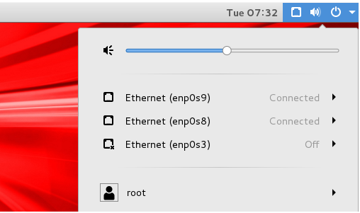
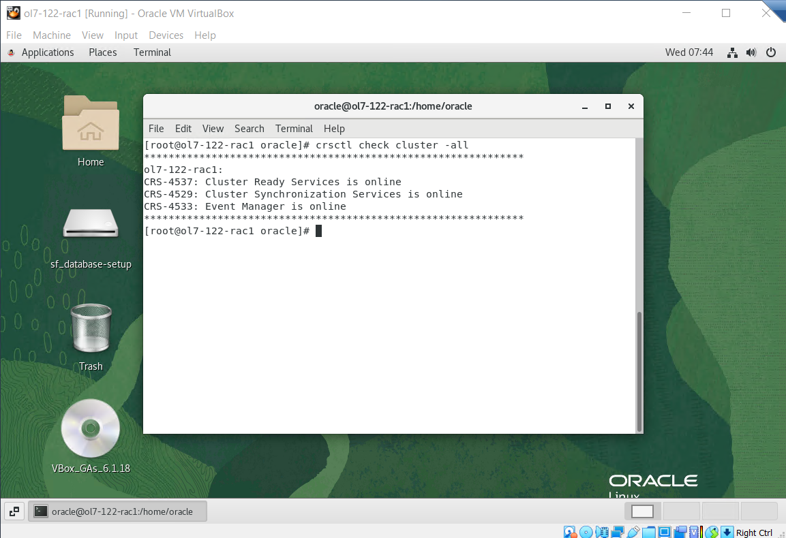

### Start RAC Database


<span style="color:red;">Note: Make sure to turn off enp0s3 and Connect enp0s8 and enp0s9 on both machines before proceeding:</span>




#### Connect to Node 1

Login as oracle user:

```
su - oracle
. grid_env
su
crsctl stop crs -f
crsctl start crs

crsctl check cluster -all
```


Run command:

```
crsctl check cluster -all
```

You will see "CRS-4639: Could not contact Oracle High Availability Services" or "CRS-4535: Cannot communicate with Cluster Ready Services" messages. Wait 5 minutes and then again check with "crsctl check cluster -all" command. This time Database administrator will get "CRS-4537: Cluster Ready Services is online". 

Run again after 4-5 minutes: `crsctl check cluster -all`





#### Connect to Node 2

Login as oracle user:

```
. grid_env
su
crsctl stop crs -f
crsctl start crs
```


#### Terminal Node 1


Wait for processes to Node 2 and run following command on both nodes after few minutes:

```
# wait 4-5 minutes
crsctl check cluster -all
```


The RAC database startup is now complete.

Check the Status of the RAC
---------------------------

There are several ways to check the status of the RAC. The `srvctl`
utility shows the current configuration and status of the RAC database.

    $ srvctl config database -d cdbrac
    Database unique name: cdbrac
    Database name: cdbrac
    Oracle home: /u01/app/oracle/product/12.2.0.1/db_1
    Oracle user: oracle
    Spfile: +DATA/CDBRAC/PARAMETERFILE/spfile.306.938083453
    Password file: +DATA/CDBRAC/PASSWORD/pwdcdbrac.285.938081999
    Domain: 
    Start options: open
    Stop options: immediate
    Database role: PRIMARY
    Management policy: AUTOMATIC
    Server pools: 
    Disk Groups: DATA
    Mount point paths: 
    Services: 
    Type: RAC
    Start concurrency: 
    Stop concurrency: 
    OSDBA group: dba
    OSOPER group: 
    Database instances: cdbrac1,cdbrac2
    Configured nodes: ol7-122-rac1,ol7-122-rac2
    CSS critical: no
    CPU count: 0
    Memory target: 0
    Maximum memory: 0
    Default network number for database services: 
    Database is administrator managed
    $

    $ srvctl status database -d cdbrac
    Instance cdbrac1 is running on node ol7-122-rac1
    Instance cdbrac2 is running on node ol7-122-rac2
    $

The `V$ACTIVE_INSTANCES` view can also display the current status of the
instances.

    $ . db_env
    $ sqlplus / as sysdba

    SQL*Plus: Release 12.2.0.1.0 Production on Wed Mar 8 11:04:42 2017

    Copyright (c) 1982, 2016, Oracle.  All rights reserved.


    Connected to:
    Oracle Database 12c Enterprise Edition Release 12.2.0.1.0 - 64bit Production

    SQL> SELECT inst_name FROM v$active_instances;


    INST_NAME
    --------------------------------------------------------------------------------
    ol7-122-rac1.localdomain:cdbrac1
    ol7-122-rac2.localdomain:cdbrac2

    SQL>

