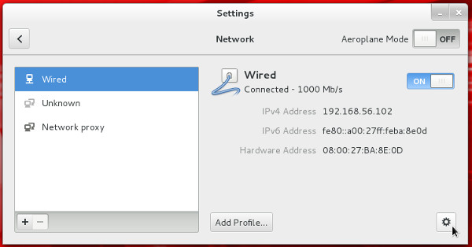

Oracle Linux 7 (OL7) Installation
=================================

This article provides a pictorial guide for performing a basic
installation of Oracle Linux 7.

- Basic Installation
- Network Configuration
- Customizing Software
- SELinux
- Firewall
- SSH

Basic Installation
------------------

1.  Boot from the DVD. Use the up arrow to pick the "Install Oracle
    Linux 7.0" option and hit the return key.

    

2.  Select the appropriate language and select the "Set keyboard to
    default layout for selected language" option, then click the
    "Continue" button.

    

3.  You are presented with the "Installation Summary" screen. You must
    complete any marked items before you can continue with the
    installation. Depending on your requirements, you may also want to
    alter the default settings by clicking on the relevant links.

    

    Click the "Installation Destination" link.

4.  If you are happy to use automatic partitioning of the whole disk,
    click the "Done" button to return to the previous screen.

    

    If you want to modify the partitioning configuration, check the "I
    will configure partitioning" option, click the "Done" button and
    work through the partitioning screens.

5.  It would be advisable to click on the "Software Selection" link and
    pick the following options if you want a GUI console.

    -   Base Environment \> Server with GUI
    -   Add-Ons for Selected Environment \> Compatibility Libraries
    -   Add-Ons for Selected Environment \> Development Tools

    Once you have completed your selections, click the "Done" button.

    

6.  Once you have completed your alterations to the default
    configuration, click the "Begin Installation" button.

    

7.  Click the "Root Password" link.

    

8.  Enter the root password and click the "Done" button.

    

    Click the "User Creation" link.

9.  Enter the user details and select the "Make this user administrator"
    option, then click the "Done" button.

    

10. Wait for the installation to complete. When prompted, click the
    "Reboot" button.

    

11. Click the "License Information" link. Check the "I accept the
    license agreement" checkbox and click the "Done" button. When you
    return to the previous screen, click the "Finish Configuration"
    button.

    

12. Decide if you want to use Kdump and click the "Forward" button.

    

13. Decide if you want to set up software updates and click the
    "Forward" button. If you chose not to register with ULN, you will
    need to confirm you decision also.

    

14. Click the "Forward" button.

    

15. On the sign-in screen, click on the user you want to log in as.

    

16. Enter the password and click the "Sign In" button.

    

17. Accept the language by clicking the "Next" button.

    

18. Accept the input sources by clicking the "Next" button.

    

19. Connect to existing data in the cloud, or just click the "Next"
    button.

    

20. Click the "Start using Oracle Linux Server" button.

    

21. You are now presented with the console screen.

    

Network Configuration
---------------------

-   If you are using DHCP to configure your network settings, then
    ignore the following network configuration screens, otherwise click
    the network icon on the top bar and click the "Network Settings"
    link. You are then presented with the "Settings" screen. Highlight
    "Wired", flick the switch to "ON" and click the cog icon at the
    bottom-right.

    

-   Click the IPv4 option, select the "Manual" method and enter the
    appropriate IP address and subnet mask, default gateway and primary
    DNS, then click the "Apply" button.

    

-   Close the "Network" dialog.

Customizing Software
--------------------

-   You can customize the installed packages using the "Software" dialog
    (Applications \> System Tools Software).

    

SELinux
-------

-   If the OS is to be used for an Oracle installation, it is easier if
    Secure Linux (SELinux) is disabled or switched to permissive. To do
    this edit the "/etc/selinux/config" file, making sure the SELINUX
    flag is set as follows.

        SELINUX=permissive

    If SELinux is configured after installation, the server will need a
    reboot for the change to take effect.

Firewall
--------

-   If the OS is to be used for an Oracle installation, you will need to
    disable or configure the local firewall.
    To disable it, do the following as the "root" user.

        # systemctl stop firewalld
        # systemctl disable firewalld

You can configure it later if you wish.

SSH
---

-   Make sure the SSH daemon is started using the following commands.

        # systemctl start sshd.service
        # systemctl enable sshd.service

